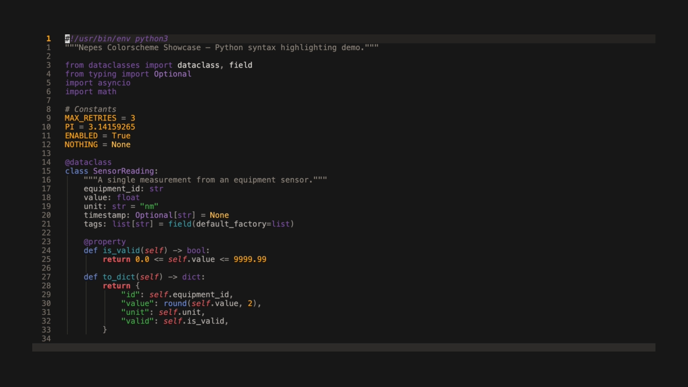

#+title: nvim-nepes
#+description: Nepes color theme for Neovim

Neovim colorscheme with treesitter and LSP support.

Part of the [[https://github.com/kayspark][Nepes Colorscheme]] suite.

* Screenshots

| Dark | Light |
|------+-------|
|  | [[file:docs/light.png]] |

** Demo

| Dark | Light |
|------+-------|
| [[file:docs/dark.gif]] |  |

* Installation

1. Add to lazy.nvim:
#+begin_src lua
{ 'kayspark/nvim-nepes', opts = { theme = 'dark' } }
#+end_src

* Configuration

#+begin_src shell
vim.cmd("colorscheme nepes")
#+end_src

* Credits

Generated by [[https://github.com/kayspark/nepes-palette][nepes-palette]].
